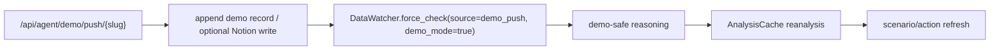
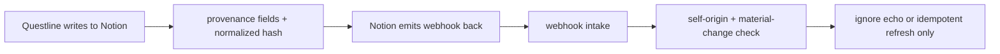

# Notion Webhook Reanalysis Implementation Plan

## Target Worktree
- Repo: `/Users/tarive/porthon-kusum-test`
- Branch base: `test/milestone1_kusum`

## Goal
Implement the full local/live Notion webhook chain so that a real Notion change can drive planner reanalysis through the Kusum watcher stack.

Target chain:

`Notion change -> webhook ingress -> normalized event -> live Notion refresh -> mirrored planner snapshot rewrite -> DataWatcher.force_check(source=live_webhook) -> AnalysisCache reanalysis -> scenario_gen -> action_planner -> updated scenarios/actions/events`

## Scope
This work is larger than webhook logging. It includes:
1. porting the dirty branch Notion `data_source` fixes
2. bridging live Notion webhook refresh into Kusum’s watcher/reanalysis stack
3. adding mirrored snapshot files for planner input
4. adding provenance/idempotency for safe Notion writes
5. adding local Cloudflare quick-tunnel E2E support and human-readable logs

## Required Base Port First
Before anything else, port the live Notion API fixes from the dirty branch into the Kusum worktree.

### Required behavior
- Use `data_source`, not `database`, in Notion search filters
- Create rows under:
  - `parent: { "type": "data_source_id", "data_source_id": ... }`
- Query rows with:
  - `POST /v1/data_sources/{id}/query`
- Keep `object=database` out of live search/setup paths

### Primary target files
- `/Users/tarive/porthon-kusum-test/src/backend/integrations/notion_leads_service.py`
- compare against:
  - `/Users/tarive/porthon/src/backend/integrations/notion_leads_service.py`

### Acceptance check
This error must be gone:
- `body.filter.value should be "page" or "data_source", instead was "database"`

## Final Architecture

### Live webhook chain

```mermaid
flowchart LR
  A["User edits live Notion row"] --> B["POST /v1/notion/webhooks"]
  B --> C["signature verify + dedupe + normalize"]
  C --> D["master.ingest_event('integration.notion.webhook.received')"]
  D --> E["_handle_notion_webhook()"]
  E --> F["refresh live Notion rows from data sources"]
  F --> G["normalize leads/time/budget state"]
  G --> H["rewrite mirrored planner snapshot files"]
  H --> I["DataWatcher.force_check(source=live_webhook, demo_mode=false)"]
  I --> J["AnalysisCache reextracts changed domains"]
  J --> K["scenario_gen re-runs"]
  K --> L["action_planner re-runs"]
  L --> M["events + queue follow-up"]
```


### Demo push chain


### Self-origin Notion write echo chain


## Design Rule: Separate Reasoning Mode from Integration Mode
Do not use env availability as the deciding factor for analysis mode.

Use explicit execution context:
- `demo_mode`
- `source`
- `notion_write`

Rules:
- demo push may still write to live Notion
- live webhook always uses `source=live_webhook`
- `demo_mode` affects planner reasoning only
- live webhook refresh should not be blocked just because demo mode exists elsewhere

## Mirrored Planner Snapshot Files
These files are the bridge from live Notion into Kusum’s file-driven reanalysis system.

### File paths
- `/Users/tarive/porthon-kusum-test/data/all_personas/persona_p05/notion_leads.jsonl`
- `/Users/tarive/porthon-kusum-test/data/all_personas/persona_p05/time_commitments.jsonl`
- `/Users/tarive/porthon-kusum-test/data/all_personas/persona_p05/budget_commitments.jsonl`

### Write model
- snapshot files, not append-only logs
- rewrite atomically on each successful live webhook refresh
- deterministic row ordering
- only rewrite when normalized content materially changes if practical

### Required row fields
Every row should include:
- `id`
- `ts`
- `text`
- `tags`
- `source`
- `origin`
- `run_id`
- `external_url`
- `notion_page_id`

### `notion_leads.jsonl`
Include:
- `lead_key`
- `name`
- `status`
- `priority`
- `deal_size`
- `next_action`
- `next_follow_up_date`
- `win_probability`
- `trust_risk`
- `lane`

### `time_commitments.jsonl`
Include:
- `title`
- `status`
- `commitment_type`
- `priority`
- `due_date`
- `execution_window_start`
- `execution_window_end`
- `estimated_minutes`
- `related_client`
- `template_key`
- `calendar_url`

### `budget_commitments.jsonl`
Include:
- `title`
- `status`
- `budget_type`
- `direction`
- `amount`
- `confidence`
- `pressure_level`
- `due_date`
- `linked_time_commitment`
- `related_client`

## Watcher / Analysis Integration
Kusum’s watcher stack should remain the reanalysis engine.

### Add planner domains
Extend the domain map with:
- `notion_leads`
- `time_commitments`
- `budget_commitments`

### Update these systems
- `DataWatcher` filename/domain mapping
- `AnalysisCache` scenario-relevant domains
- extractor domain readers
- `data_refs` generation
- prompt inputs for:
  - `pipeline/scenario_gen.py`
  - `pipeline/action_planner.py`

### Expected planner effects
#### `scenario_gen.py`
Should start seeing:
- pipeline pressure
- due-soon lead follow-ups
- due-soon time commitments
- budget pressure
- inflow/outflow pressure

#### `action_planner.py`
Should start generating actions from:
- top monetization leads
- due time commitments
- high-pressure budget commitments
- refs from mirrored rows (`nl_*`, `tc_*`, `bc_*`)

## Webhook Handler Changes
### Primary file
- `/Users/tarive/porthon-kusum-test/src/backend/deepagent/loop.py`

### In `_handle_notion_webhook(...)`
After live Notion refresh:
1. normalize leads/time/budget rows
2. update runtime state (`lead_os`, operator brief if applicable)
3. rewrite:
   - `notion_leads.jsonl`
   - `time_commitments.jsonl`
   - `budget_commitments.jsonl`
4. call `DataWatcher.force_check(...)` with:
   - `source="live_webhook"`
   - `demo_mode=False`
   - `notion_write=True`
5. append a runtime event such as:
   - `notion_leads_refreshed`
6. let normal cycle/run continue

### Step 2 implementation note for this repo
- Current worktree supports full live `notion_leads.jsonl` mirroring now.
- `time_commitments.jsonl` and `budget_commitments.jsonl` are created as deterministic empty snapshot files in step 2 so the watcher/domain bridge exists without inventing unsupported live Notion fetches.
- The old dirty operator workspace (`time commitments`, `budget commitments`, weekly brief, templates) still needs a later port before those two mirrored files can be populated from live Notion.

## DataWatcher Changes
### Primary file
- `/Users/tarive/porthon-kusum-test/src/backend/daemon/watcher.py`

### Required changes
- `force_check()` must accept explicit context
- thread context through:
  - `_check_files()`
  - `_on_file_changed()`
  - `_reanalyze()`
- stop inferring live-vs-demo reasoning from env alone

### Required semantics
- `demo_push`:
  - `demo_mode=True`
- `live_webhook`:
  - `demo_mode=False`

### KG rule
- demo mode should not attempt live KG query unless explicitly intended
- live webhook may use live KG if configured
- KG must remain optional to successful webhook-driven refresh

## Provenance / Loop Prevention
### Every outbound Notion write should include
- `Questline Source`
- `Questline Run ID`
- `Questline Origin`
- `Questline Updated At`

### Webhook echo handling
When a webhook arrives for a self-originated row:
- compare normalized content hash
- if no material change, do not re-trigger semantic planning loop
- allow idempotent refresh if useful, but avoid infinite loops

## Logging Spec
Use one `event_id` across the chain.

### Required log lines
- `NOTION WEBHOOK RECEIVED event_id=<id> type=<type> relevant=<bool> deduped=<bool> entity=<entity_type>:<entity_id>`
- `NOTION REFRESH START event_id=<id> data_source_id=<id> source=live_webhook`
- `NOTION REFRESH OK event_id=<id> leads=<n> time_commitments=<n> budget_commitments=<n>`
- `NOTION MIRROR WRITE event_id=<id> file=notion_leads.jsonl rows=<n> changed=<bool>`
- `NOTION MIRROR WRITE event_id=<id> file=time_commitments.jsonl rows=<n> changed=<bool>`
- `NOTION MIRROR WRITE event_id=<id> file=budget_commitments.jsonl rows=<n> changed=<bool>`
- `WATCHER FORCE CHECK source=live_webhook demo_mode=false event_id=<id>`
- `REANALYSIS START event_id=<id> domains=<comma-separated-domains> has_llm=<bool>`
- `REANALYSIS RESULT event_id=<id> scenarios_regenerated=<bool> actions_regenerated=<bool>`
- `WEBHOOK ECHO SKIPPED event_id=<id> reason=self_originated_no_material_change`
- `REANALYSIS FAILED event_id=<id> stage=<stage> error=<message>`

## Cloudflare Local E2E
### Local backend target
- `http://localhost:8000`

### Tunnel
```bash
cloudflared tunnel --url http://localhost:8000
```

### Local Notion webhook target
- `https://<random>.trycloudflare.com/v1/notion/webhooks`

### Important note
Quick tunnel hostname changes on restart. That is fine for now. Just update the Notion webhook target each time.

## Curl E2E Checks
### Verification payload
```bash
curl -X POST "https://<random>.trycloudflare.com/v1/notion/webhooks" \
  -H "Content-Type: application/json" \
  -d '{
    "type": "url_verification",
    "verification_token": "notion_verify_test_123"
  }'
```

### Signed replay
```bash
RAW='{"id":"notion_evt_test_001","type":"page.updated","entity":{"id":"test_page_123","type":"page"},"timestamp":"2026-03-06T21:45:00Z"}'
SIG=$(printf '%s' "$RAW" | openssl dgst -sha256 -hmac "$NOTION_WEBHOOK_VERIFICATION_TOKEN" -hex | sed 's/^.* //')

curl -X POST "https://<random>.trycloudflare.com/v1/notion/webhooks" \
  -H "Content-Type: application/json" \
  -H "X-Notion-Signature: sha256=$SIG" \
  -d "$RAW"
```

## What To Verify In Notion
Edit a field that should materially affect planning:
- lead status
- next follow-up date
- deal size
- time commitment due date/status
- budget commitment amount/pressure/due date

Do not start with cosmetic changes.

## What To Verify Locally
### Runtime
- webhook accepted
- live Notion rows refreshed
- mirrored files rewritten
- watcher triggered from `source=live_webhook`
- scenarios/actions refreshed if planner inputs changed

### On disk
- `notion_leads.jsonl` changed
- `time_commitments.jsonl` changed
- `budget_commitments.jsonl` changed

### In events/UI
- `integration.notion.webhook.received`
- `notion_leads_refreshed`
- `scenarios_updated` and/or `actions_updated`
- operator/quest surfaces reflect the change

## Implementation Order
1. Port dirty branch Notion `data_source` behavior into Kusum worktree
1.5. Add demo-feed frontend push -> best-effort live Notion lead sync for the 4 scripted demo states
2. Add mirrored snapshot file writers
3. Extend watcher context and domain map
4. Extend extractor + `data_refs`
5. Extend `scenario_gen.py`
6. Extend `action_planner.py`
7. Add provenance/idempotency for outbound Notion writes
8. Add Cloudflare local E2E docs and `curl` checks
9. Add tests

## Execution Log
### Step 1 status
- in progress in Kusum worktree
- scope intentionally narrow:
  - `/Users/tarive/porthon-kusum-test/src/backend/integrations/notion_leads_service.py`
  - `/Users/tarive/porthon-kusum-test/src/backend/tests/fast/test_notion_leads_service.py`
- exact ported behaviors:
  - `find_database_by_title()` must search with `filter.value=data_source`
  - title resolution must tolerate search items that expose `name` instead of `title`
  - existing data source search hits must recover the parent `database_id`
  - `ensure_workspace()` must reuse the recovered `database_id` and matching `data_source_id`
- non-goals for step 1:
  - no webhook-to-watcher bridge yet
  - no mirrored planner file writes yet
  - no operator workspace refresh yet
  - no planner prompt changes yet

### Step 1.5 status
- scope: frontend-triggered demo push should also mirror into the live Notion leads database for the four existing scripted demo buttons
- target path:
  - `/Users/tarive/porthon-kusum-test/src/backend/app/api/routes_agent.py`
- execution rule:
  - keep current local JSONL append + watcher force-check behavior
  - add a second best-effort branch:
    - map demo slug -> deterministic lead-shaped payload
    - resolve current live Notion leads workspace
    - call `sync_leads(strict_reconcile=false)` so no existing rows are removed
  - if Notion is unconfigured or sync fails:
    - do not fail the demo push
    - return `notion_sync.status=skipped|failed`
- transitional limitation:
  - this is intentionally a demo bridge, not the final planner-domain architecture
  - all four scripted events are coerced into lead-shaped rows for visibility in the live Notion pipeline
  - proper finance/social/time/budget domain handling remains step 2 + step 3 work

### Step 2 detailed run plan
Goal: bridge a live Notion refresh into file-backed planner inputs without changing the watcher to a completely different architecture.

Files to touch:
- `/Users/tarive/porthon-kusum-test/src/backend/deepagent/loop.py`
- `/Users/tarive/porthon-kusum-test/src/backend/daemon/watcher.py`
- `/Users/tarive/porthon-kusum-test/src/backend/integrations/notion_leads_service.py`
- `/Users/tarive/porthon-kusum-test/src/backend/app/api/routes_agent.py`
- `/Users/tarive/porthon-kusum-test/src/backend/tests/fast/test_notion_webhooks_api.py`
- new helper module if needed under:
  - `/Users/tarive/porthon-kusum-test/src/backend/integrations/` or `/Users/tarive/porthon-kusum-test/src/backend/daemon/`

Step 2A: mirrored snapshot bridge
- add deterministic normalizers for:
  - leads rows -> `notion_leads.jsonl`
  - time commitment rows -> `time_commitments.jsonl`
  - budget commitment rows -> `budget_commitments.jsonl`
- row ids should use stable prefixes:
  - `nl_<slug-or-hash>`
  - `tc_<slug-or-hash>`
  - `bc_<slug-or-hash>`
- each row must contain:
  - common: `id`, `ts`, `text`, `tags`, `source`, `origin`, `run_id`, `external_url`, `notion_page_id`
  - domain-specific fields from the sections above
- deterministic ordering:
  - leads: by `lead_key`, then `notion_page_id`
  - time commitments: by earliest `due_date`, then `title`, then `notion_page_id`
  - budget commitments: by earliest `due_date`, then `pressure_level`, then `title`, then `notion_page_id`
- write model:
  - render full normalized content in memory
  - compare normalized hash against existing file content
  - only rewrite if bytes changed
  - rewrite atomically via temp file + replace

Step 2B: webhook refresh bridge
- in `_handle_notion_webhook(...)`:
  - log `NOTION REFRESH START`
  - refresh leads from configured leads data source
  - if `operator_workspace` exists and is live, also refresh:
    - `time_commitments`
    - `budget_commitments`
  - update runtime state:
    - `lead_os`
    - `operator_brief` only when operator workspace is valid
    - lightweight counts/hash metadata for mirrored file state
  - write three snapshot files
  - append runtime event `notion_leads_refreshed`
  - trigger watcher with explicit context:
    - `source="live_webhook"`
    - `demo_mode=False`
    - `notion_write=True`
    - same `event_id`

Step 2C: watcher context threading
- extend `RunContext` if needed to include:
  - `event_id`
  - `trigger_domains`
- change `force_check()` signature so callers pass explicit context instead of a single `demo_mode` bool
- update existing callers:
  - demo push path should pass `source="demo_push"` and `demo_mode=True`
  - manual/default path should pass `source="manual"` and preserve current behavior
- logging requirements:
  - `WATCHER FORCE CHECK source=<source> demo_mode=<bool> event_id=<id>`
  - `REANALYSIS START ...`
  - `REANALYSIS RESULT ...`
  - `REANALYSIS FAILED ...`

Step 2D: step 2 tests
- fast test for webhook refresh rewriting mirrored files
- fast test for unchanged normalized content producing `changed=false`
- fast test for watcher context on webhook path:
  - `source=live_webhook`
  - `demo_mode=False`
- fast test for demo push retaining:
  - `source=demo_push`
  - `demo_mode=True`

### Step 3 detailed run plan
Goal: make the new mirrored files materially influence scenario and action generation through the existing extractor/cache pipeline.

Files to touch:
- `/Users/tarive/porthon-kusum-test/src/backend/pipeline/extractor.py`
- `/Users/tarive/porthon-kusum-test/src/backend/daemon/analysis_cache.py`
- `/Users/tarive/porthon-kusum-test/src/backend/pipeline/scenario_gen.py`
- `/Users/tarive/porthon-kusum-test/src/backend/pipeline/action_planner.py`
- `/Users/tarive/porthon-kusum-test/src/backend/tests/fast/test_master_loop.py`
- new fast tests for extractor/cache/planner paths

Step 3A: extractor extensions
- add domain readers:
  - `extract_notion_leads(persona_id)`
  - `extract_time_commitments(persona_id)`
  - `extract_budget_commitments(persona_id)`
- summarize for planner use, not raw dumps:
  - leads:
    - open lead count
    - due-soon follow-up count
    - top high-value open leads
    - lane or status distribution
  - time commitments:
    - due-soon count
    - blocked count
    - high-priority total estimated minutes
  - budget commitments:
    - due-soon inflow total
    - due-soon outflow total
    - high-pressure items
- include mirrored records in `data_refs`

Step 3B: AnalysisCache extensions
- extend `_DOMAIN_MAP` / `_DOMAIN_FILE` usage for:
  - `notion_leads`
  - `time_commitments`
  - `budget_commitments`
- add these to scenario-relevant domains
- ensure hash inputs mirror prompt inputs exactly
- action hash should include any new sections consumed by `action_planner._build_prompt()`

Step 3C: scenario generation changes
- expand prompt inputs to mention:
  - pipeline pressure
  - due follow-ups
  - near-term workload pressure
  - budget inflow vs outflow pressure
- keep prompt compact:
  - summarized metrics first
  - 2-4 representative concrete refs at most
- expected outcome:
  - scenarios should reference monetization pressure and execution bottlenecks when mirrored data warrants it

Step 3D: action planning changes
- available `data_ref` pool should include:
  - `nl_*`
  - `tc_*`
  - `bc_*`
- action selection should prioritize:
  - top monetization leads with due follow-up
  - due or blocked time commitments
  - high-pressure budget commitments
- action rationales should connect scenario outcome to one concrete mirrored row

Step 3E: step 3 tests
- extractor unit tests for each new domain summary
- cache tests proving changed mirrored files regenerate scenarios/actions
- prompt-facing tests or deterministic patches proving:
  - lead follow-up changes can affect scenarios/actions
  - time commitment changes can affect actions
  - budget pressure changes can affect scenarios/actions
- `data_refs` tests ensuring `nl_*`, `tc_*`, and `bc_*` are exposed

## Test Plan
### API correctness
- live setup/sync no longer uses `object=database`
- data source create/query paths work
- webhook verification + signed payload acceptance work

### Snapshot bridge
- live webhook refresh rewrites mirrored files
- unchanged content does not create noisy rewrites if normalization hash is used

### Reanalysis
- lead change triggers scenario/action refresh
- time commitment change affects actions
- budget commitment change affects scenarios/actions

### Loop prevention
- self-originated writes do not create infinite webhook-planning loops

### Local E2E
- Cloudflare quick tunnel reaches local backend
- signed `curl` replay works
- real Notion edits trigger local refresh + reanalysis chain

## Notes
- Cloud Run remains production ingress:
  - `https://porthon-backend-764384012546.us-central1.run.app/v1/notion/webhooks`
- Local tunnel is only for local E2E testing
- Polling is fallback only; webhook path is primary
```
